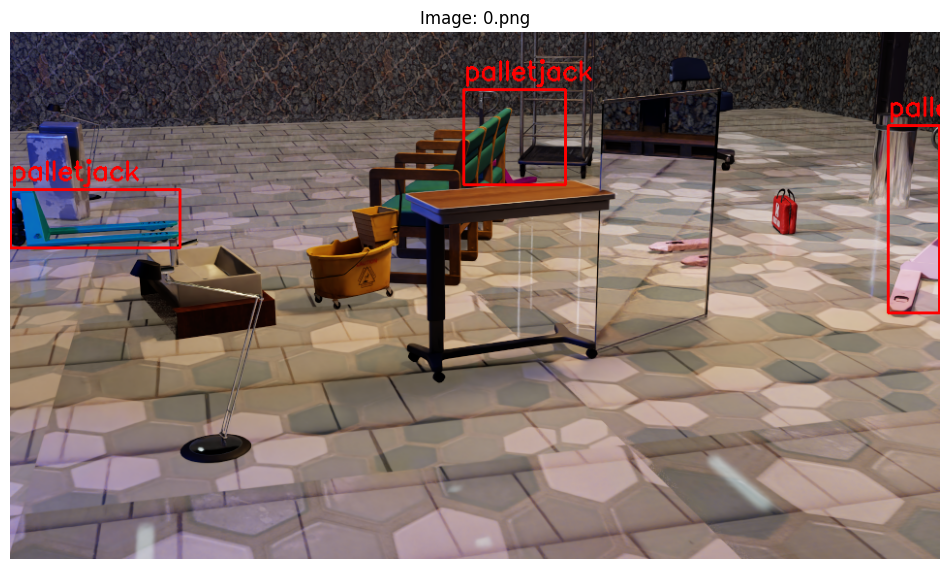

# Synthetic-Data-Generation-for-Perception
**A simulated warehouse, a few thousand rendered frames, and the quest for decent segmentation masks.**

The foundation for this project comes from the structured learning I completed through NVIDIA's official Isaac Sim synthetic data course (DLI S-OV-30). The training covered the essentials of scene setup and asset management. And also offered practical guidance on semantic annotation strategies and of course the use of the Replicator extension.

The official notebooks and lab material set a clear starting point, but found there were subtle implementation details and workflow decisions that were best discovered through direct experimentation. By adapting the core examples, I was able to refine the process and address some of the more specific challenges that arose.

In a sense, the approach here may resemble the original NVIDIA pipeline, but most of the solutions reflect a combination of the course’s methodology and some situational adjustments made for portfolio relevance. This blend of formal instruction and tailored exploration, I believe, may suggest a pragmatic path for others working with synthetic data in vision applications.

*This project explores how you can generate annotated computer vision data—plus a healthy dose of RGB, depth, and pixelwise class labels—using NVIDIA Isaac Sim and TAO Toolkit. If you ever wondered how far you can get before running into the real/sim-to-real gap, you’re in the right place.*

***

### Quick Project Summary

- **What it does:**  
  Builds and annotates synthetic warehouse environments for object detection and semantic segmentation tasks. Provides perfectly aligned RGB, semantic, and depth images with every run.
- **Intended audience:**  
  People working in computer vision, robotics, or anyone curious about simulation-driven training data.
- **Tech involved:**  
  Isaac Sim, Replicator, TAO Toolkit, and Jupyter.

***
## Data Generation Notebook

Most of the data generation code is sourced from NVIDIA’s Isaac Sim synthetic data course (DLI S-OV-30). 
I changed only the asset paths and output directories to match my personal setup—core logic and annotation strategies remain as instructed in the course. 
For theoretical explanation and further details, see the official material:  
[https://learn.nvidia.com/courses/course?course_id=course-v1:DLI+S-OV-30+V1](https://learn.nvidia.com/courses/course?course_id=course-v1:DLI+S-OV-30+V1)

Generated data samples
https://github.com/leanalh/Synthetic-Data-Generation-for-Perception/blob/main/data_samples/generated_output.png

### About

**Synthetic warehouse scenes with multi-modal annotation, built for the curious, the cautious, and anyone tired of hand-labeling training images.**  

